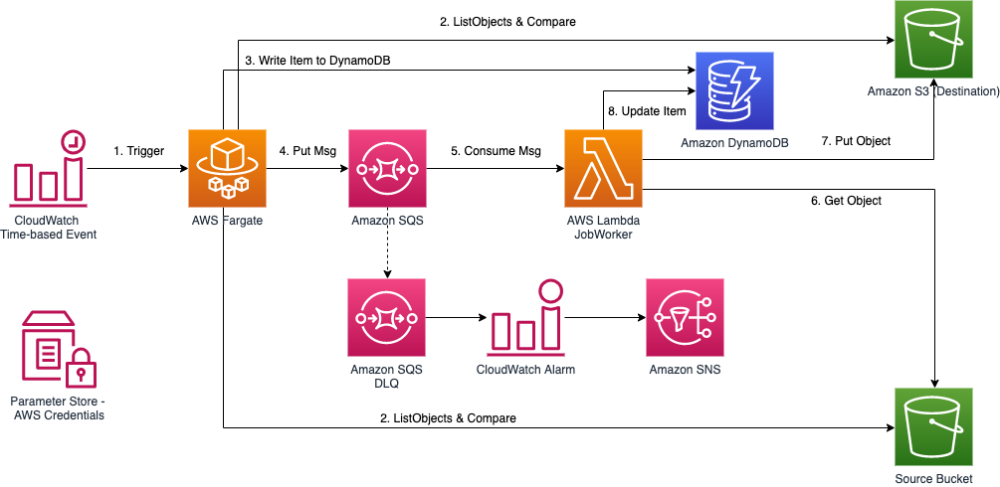

[中文](./README_CN.md)

# Data Transfer Hub - S3 Plugin

## Table of contents
* [Introduction](#introduction)
* [Breaking Change](#breaking-change)
* [Architect](#architect)
* [Deployment](#deployment)
* [FAQ](#faq)
  * [How to monitor](#how-to-monitor)
  * [How to debug](#how-to-debug)
  * [No log streams in CloudWatch](#no-log-streams-in-cloudwatch)
  * [How to customize](#how-to-customize)
* [Known Issues](#known-issues)

## Introduction

[Data Transfer Hub](https://github.com/awslabs/aws-data-replication-hub), a.k.a Data Replication Hub, is a solution for transferring data from different sources into AWS. This project is for S3 Transfer plugin. You can deploy and run this plugin independently without the UI. 

_This Date Transfer Hub - S3 Plugin is based on [amazon-s3-resumable-upload](https://github.com/aws-samples/amazon-s3-resumable-upload) contributed by [huangzbaws@](https://github.com/huangzbaws)._

The following are the features supported by this plugin.

- Transfer Amazon S3 objects between AWS China regions and Global regions
- Transfer objects from Aliyun OSS / Tencent COS / Qiniu Kodo
- Large file support
- Support S3 Event trigger
- Support Transfer with object metadata
- Support incremental data transfer
- Support transfer from S3 compatible storage
- Auto retry and error handling

## Breaking Change

Start from release v2.0.2, we have changed to use Secrets Manager to maintain the Credentials rather than using System Manager Parameter Store.  

If you have deployed a version before v2.0.2 (You can go to CloudFormation, check the Stack Info, the description will have the version info) and you want to upgrade, you must **DELETE** the existing stack and then follow the steps in the [Deployment Guide](./docs/DEPLOYMENT_EN.md) to redeploy the new version.

> Please note that once you delete the old version, any existing resource provisioned by the solution such as DynamoDB table and SQS queue and CloudWatch Dashboard will be removed as well, but existing objects in destination bucket won't be transferred again.

## Architect

A *Finder* job running in AWS Fargate lists all the objects in source and destination buckets and determines what objects should be transferred, a message for each object to be transferred will be created in SQS. A *time-based CloudWatch rule* will trigger the ECS task to run every hour. 

This plugin also supports S3 Event notification to trigger the data transfer (near real-time), only if the source bucket is in the same account (and region) as the one you deploy this plugin to. The event message will also be sent the same SQS queue.

The *Worker* job running in EC2 consumes the message in SQS and transfer the object from source bucket to destination bucket. You can use Auto Scaling Group to controll the number of EC2 instances to transfer the data based on your business need.

If an object or a part of an object failed to transfer, the EC2 instance will release the message in the Queue, and the object will be transferred again after the message is visible in the queue (Default visibility timeout is set to 15 minutes, extended for large objects). After a few retries, if the transfer still failed, the message will be sent to the Dead Letter Queue and an alarm will be triggered.

This plugin supports transfer large size file. It will divide it into small parts and leverage the [multipart upload](https://docs.aws.amazon.com/AmazonS3/latest/dev/mpuoverview.html) feature of Amazon S3.

> Note: This solution uses `t4g.micro` EC2 instance type to save cost. The pricing of this instance type is `$0.0084 per Hour` in US West (Oregon) region at the point of writing. Check out [EC2 Pricing](https://aws.amazon.com/ec2/pricing/on-demand/) to get the latest price. And the EC2 operating systems will by default have BBR (Bottleneck Bandwidth and RTT) enabled to improve network performance.

## Deployment

Things to know about the deployment of this plugin:

- The deployment will automatically provision resources like lambda, dynamoDB table, ECS Task Definition, etc. in your AWS account.
- The deployment will take approximately 3-5 minutes.
- Once the deployment is completed, the data transfer task will start right away.

Please follow the steps in the [Deployment Guide](./docs/DEPLOYMENT_EN.md) to start the deployment.

> Note: You can simply delete the stack from CloudFormation console if the data transfer job is no longer required.

## FAQ

### How to monitor

**Q**: After I deployed the solution, how can I monitor the progress?

**A**: After deployment, there will be a cloudwatch dashboard created for you to mornitor the progress, metrics such as running/waiting jobs, network, transferred/failed objects will be logged in the dashboard. Below screenshot is an example:

### How to debug

**Q**: There seems to be something wrong, how to debug?

**A**: When you deploy the stack, you will be asked to input the stack name (default is DTHS3Stack), most of the resources will be created with name prefix as the stack name.  For example, Queue name will be in a format of `<StackName>-S3TransferQueue-<random suffix>`.

There will be two main log groups created by this plugin.

- &lt;StackName&gt;-ECSStackJobFinderTaskDefDefaultContainerLogGroup-&lt;random suffix&gt;

This is the log group for scheduled ECS Task. If there is no data transferred, you should check if something is wrong in the ECS task log. This is the first step.

- &lt;StackName&gt;-EC2WorkerStackS3RepWorkerLogGroup-&lt;random suffix&gt;

This is the log group for all EC2 instances, detailed transfer log can be found here.

If you can't find anything helpful in the log group, please raise an issue in Github.

### No log streams in CloudWatch

**Q**: After I deployed, I can't find any log streams in the two CloudWatch Log Groups

**A**: This must because the subnets you choose when you deployed this solution doesn't have public network access, therefore, the Fargate task failed to pull the images, and the EC2 can't download the CloudWatch Agent to send logs to CloudWatch.  So please check you VPC set up (See [Deployment Guide](./docs/DEPLOYMENT_EN.md) Step 1). Once you fix the issue, you need to manually terminate the running EC2 instances by this solution if any. After that, the auto scaling group will automatically start new ones.

### How to customize

**Q**: I want to make some custom changes, how do I do?

If you want to make custom changes to this plugin, you can follow [custom build](./docs/CUSTOM_BUILD.md) guide.

## Known Issues

In this new V2 release (v2.x.x), we are expecting below known issues:

- Google GCS is no longer supported (you may contact us)

If you found any other issues, please raise one in Github Issue, we will work on the fix accordingly.
