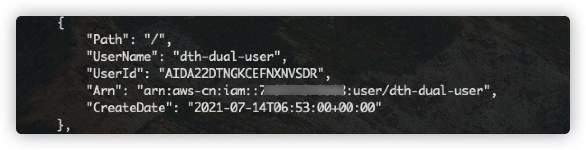

[中文](./DUAL_WAY_DEPLOYMENT_CN.md)

# Deploy Dual-Way Synchronization

This version supports dual-way synchronization between the S3 buckets of two accounts. This tutorial will guide you through the deployment.


To achieve dual-way synchronization between the S3 buckets of two accounts, the Solution needs to be deployed once in each of the two accounts. 

The system architecture diagram is shown in the following figure. Among them, Account A is located in the China Region, and Account B is located in the Global Region. This tutorial will guide you to complete the deployment of the Data Transfer Hub S3 plugin in Account A and Account B respectively.


The **core work** of this solution is to **recognize** the extra transmission due to repeated triggers through the UserID of the dedicated IAM user in the two accounts, and **terminate** the data transmission caused by the loop trigger.

Although the goal of this solution is to synchronize the S3 buckets in the China Region and the Global Region, you can also use this to achieve dual-way synchronization of any two S3 buckets.

## Deployment steps
* [PreRequest](#PreRequest)
    * [Step1 Create a dedicated IAM user in Account A](#Step1-Create-a-dedicated-IAM-user-in-Account-A)
    * [Step2 Get the userID of Account A's dedicated user](#Step2-Get-the-userID-of-Account-A's-dedicated-user)
    * [Step3 Create a dedicated IAM user in Account B](#Step3-Create-a-dedicated-IAM-user-in-Account-B)
    * [Step4 Get the userID of Account B's dedicated user](#Step4-Get-the-userID-of-Account-B's-dedicated-user)
* [ConfigCredential](#ConfigCredential)
    * [Step5 Configure Secrets Manager for Account A](#Step5-Configure-Secrets-Manager-for-Account-A)
    * [Step6 Configure Secrets Manager for Account B](#Step6-Configure-Secrets-Manager-for-Account-B)
* [Deployment](#Deployment)
    * [Step7 Deploy Data Transfer Hub S3 Plugin in Account A](#Step7-Deploy-Data-Transfer-Hub-S3-Plugin-in-Account-A)
    * [Step8 Deploy Data Transfer Hub S3 Plugin in Account B](#Step8-Deploy-Data-Transfer-Hub-S3-Plugin-in-Account-B)
* [FAQ](#faq)
  * [How to confirm dual-way synchronization](#How-to-confirm-that-dual-way-synchronization-is-deployed)
  * [How to monitor](#how-to-monitor)
  * [How to debug](#how-to-debug)
  * [No CloudWatch logs](#no-cloudwatch-logs)
  * [How to customize](#how-to-customize)

> Note: In this tutorial, we assume that Account A selects cn-north-1 of China Region, and Account B selects us-west-2 of Global Region.

# PreRequest

## Step1 Create a dedicated IAM user in Account A

### 1) Create Policy

Log in to the IAM console of Account A, here we log in [cn-north-1 console](https://console.amazonaws.cn/iamv2/home#/policies). 

Click **Create Policy**, choose **JSON**, enter the following Json, **Please replace dth-dual-dev-cn-north-1 with your S3 bucket name in Account A**：

```json
{
    "Version": "2012-10-17",
    "Statement": [
        {
            "Action": [
                "s3:ListBucket",
                "s3:GetObject",
                "s3:PutObject",
                "s3:DeleteObject",
                "s3:AbortMultipartUpload",
                "s3:ListBucketMultipartUploads",
                "s3:PutObjectAcl",
                "s3:ListMultipartUploadParts"
            ],
            "Resource": [
                "arn:aws-cn:s3:::dth-dual-dev-cn-north-1",
                "arn:aws-cn:s3:::dth-dual-dev-cn-north-1/*"
            ],
            "Effect": "Allow"
        }
    ]
}
```

Then click **Next: Tags**, **Next: Review**, enter the name of Policy, here we enter `dth-dual-policy`, and then click **Create Policy**.

### 2) Create User
After completing the policy creation, we need to create a User and attach the Policy created in the previous step to the User.

Log in to the User tab of the IAM console of Account A, here we log in to the [console of cn-north-1](https://console.amazonaws.cn/iamv2/home#/users). 

Click **Add Users**, then enter the **User name**, for example here we use `dth-dual-user`, and choose the **Programmatic access**

Then click **Nest: Permissions**, Select **Attach existing policies directly** and select the policy created in the previous step, such as `dth-dual-policy`:


Then click **Next: Tags**, **Next: Review**, and click **Create User**.

**Note:** Please record your `AccessKeyID` and `SecretAccessKey` (ie `AK/SK`), which you will use in **Step6** Configure Account B's Secrets Manager, which will give Account B access to S3 data in Account A The permissions of the bucket.

## Step2 Get the userID of Account A's dedicated user

As described in the architecture diagram, this solution will use UserID to identify additional transmissions due to repeated triggers, and terminate data transmissions due to cyclic triggers.

Please install and configure **AWS CLI** in your local environment, please refer to [Tutorial](https://docs.aws.amazon.com/zh_cn/cli/latest/userguide/install-cliv2.html) . (Or you can activate an EC2 in this account and give it administrator privileges.)

Then enter in Terminal:

```shell
aws iam list-users
```


Record the UserId of the User you created in **Step1**, as shown in the figure `AIDA22DTNGKCEFNXNVSDR`, you will use this UserID in **Step7**.

## Step3 Create a dedicated IAM user in Account B

Similarly, we will also create Policy and corresponding User in Account B.

### 1) Create Policy

Log in to the IAM console of Account B, here we log in [Global console](https://console.aws.amazon.com/iamv2/home?#/policies). 

Click **Create Policy**, then click **JSON**, enter the following Json, **please replace dth-dual-dev-us-west-2 with the S3 bucket name in your Account B**:

```json
{
    "Version": "2012-10-17",
    "Statement": [
        {
            "Action": [
                "s3:ListBucket",
                "s3:GetObject",
                "s3:PutObject",
                "s3:DeleteObject",
                "s3:AbortMultipartUpload",
                "s3:ListBucketMultipartUploads",
                "s3:PutObjectAcl",
                "s3:ListMultipartUploadParts"
            ],
            "Resource": [
                "arn:aws:s3:::dth-dual-dev-us-west-2",
                "arn:aws:s3:::dth-dual-dev-us-west-2/*"
            ],
            "Effect": "Allow"
        }
    ]
}
```

Then click **Next: Tags**, **Next: Review**, then enter the name of the policy, for example, enter `dth-dual-policy` here, and click **Create Policy**.

### 2) Create User

Similarly, after completing the policy creation, we need to create a User and assign the Policy created in the previous step to the User.

Log in to the User tab of the IAM console of Account B, here we log in [Global console](https://console.aws.amazon.com/iamv2/home#/users). 

Click **Add Users**, and then enter the User name in **User name**, you can name it arbitrarily, here let it be `dth-dual-user`, and check **Programmatic access**

Then click **Nest: Permissions**, select **Attach existing policies directly** and select the policy created in the previous step, such as `dth-dual-policy`:


Then click **Next: Tags**, **Next: Review**, and click **Create User**.

**Note:** Please record your `AccessKeyID` and `SecretAccessKey` (ie `AK/SK`), which you will use in **Step5** Configure Account A's Secrets Manager, which will give Account A access to S3 data in Account B The permissions of the bucket.

## Step4 Get the userID of Account B's dedicated user

After completing the creation of the User, we need to obtain its corresponding UserID.


> Note: In the Global area, you can obtain the UserID directly through CloudShell.

Log in to [CloudShell Console](https://us-west-2.console.aws.amazon.com/cloudshell/home?region=us-west-2), then enter in Terminal:

```shell
aws iam list-users
```


Record the **UserId** of the User you created in **Step3**, as in the figure `AIDAYCQ5VG226XD5UCUOR`, you will use this UserID in **Step8**.

# ConfigCredential

## Step5 Configure Secrets Manager for Account A

You need to provide `AccessKeyID` and `SecretAccessKey` (ie `AK/SK`) to read from or write to the bucket in S3 from another AWS account (ie Account B). The credentials will be stored in AWS Secrets Manager.

Open the [Secrets Manager](https://console.amazonaws.cn/secretsmanager/home?region=cn-north-1#!/listSecrets) of the Account A `cn-north-1` Region management console.  

On the Secrets Manager homepage, click **Store a new secret**. For the key type, please use **Other type of secrets**. For the key/value pair, please copy and paste the JSON text below into Plaintext Section, and change the value accordingly to the AK/SK of the User you created in Account B us-west-2 in **Step3**.

```
{
  "access_key_id": "<Your Access Key ID>",
  "secret_access_key": "<Your Access Key Secret>"
}
```


Then specify the key name in the next step, for example, named here `dth-credentials-us-west-2`, and click Create in the last step.

## Step6 Configure Secrets Manager for Account B

Similarly, create a secret key in Secretes Manager for accessing S3 data in Account A in Account B.

Open the [Secrets Manager](https://us-west-2.console.aws.amazon.com/secretsmanager/home?region=us-west-2#!/listSecrets) of the Account B `us-west-2` Region management console.  

On the Secrets Manager homepage, click **Store a new secret**. For the key type, please use **Other type of secrets**. For the key/value pair, please copy and paste the JSON text below into Plaintext Section, and change the value accordingly to the AK/SK of the User you created in Account A cn-north-1 in **Step1**.

```
{
  "access_key_id": "<Your Access Key ID>",
  "secret_access_key": "<Your Access Key Secret>"
}
```


Then in the next step, specify the key name, for example, here it is named `dth-credentials-cn-north-1`, and in the last step, click Create.


# Deployment

## Step7 Deploy Data Transfer Hub S3 Plugin in Account A

Click the button below to launch the CloudFormation stack in this area.

  - Deploy to AWS China Beijing or Ningxia Region

  [](https://console.amazonaws.cn/cloudformation/home#/stacks/create/template?stackName=DTHS3DualStack&templateURL=https://drh-solution.s3.cn-northwest-1.amazonaws.com.cn/dth-s3-sync-plugin/v1.1.2/DataTransferS3Stack-ec2.template)

**Note**: In the `userID for Two Way Synchronization` of the template parameter, fill in the UserID you obtained in **Step2**, in this case AIDA22DTNGKCEFNXNVSDR. The parameters of China Region in this test case are as follows:


## Step8 Deploy Data Transfer Hub S3 Plugin in Account B

Click the button below to launch the CloudFormation stack in this area.

  - Deploy to AWS Global regions

  [](https://console.aws.amazon.com/cloudformation/home#/stacks/create/template?stackName=DTHS3DualStack&templateURL=https://drh-solution.s3.us-west-2.amazonaws.com/dth-s3-sync-plugin/v1.1.2/DataTransferS3Stack-ec2.template)

**Note**: In the `userID for Two Way Synchronization` of the template parameter, fill in the UserID you obtained in **Step4**, in this case AIDAYCQ5VG226XD5UCUOR. The parameters of the Global Region in this test case are as follows:


## FAQ

### How to confirm that dual-way synchronization is deployed

**Q**：After deploying the solution, how can I confirm that the dual-way synchronization has been successfully deployed?

**A**：After deployment, you can upload a file to any S3 bucket on both sides. For example, upload a file to S3 of Account B. Then you can open the Cloudwatch log group of Account B and find the log group in the following format, which is EC2 Worker log information:

- &lt;StackName&gt;-EC2WorkerStackS3RepWorkerLogGroup&lt;random suffix&gt;

If you see a log message of `Repeated transfer job!`, it means that the two-way synchronization has started, and the Worker has successfully identified the repeated trigger message.


### How to monitor

**Q**: After I deployed the solution, how can I monitor the progress?

**A**: After deployment, there will be a cloudwatch dashboard created for you to mornitor the progress, metrics such as running/waiting jobs, network, transferred/failed objects will be logged in the dashboard. Below screenshot is an example:


### How to debug

**Q**: There seems to be something wrong, how to debug?

**A**: When you deploy the stack, you will be asked to input the stack name (default is DTHS3Stack), most of the resources will be created with name prefix as the stack name.  For example, Queue name will be in a format of `<StackName>-S3TransferQueue-<random suffix>`.

There will be two main log groups created by this plugin.

- &lt;StackName&gt;-ECSStackFinderLogGroup&lt;random suffix&gt;

This is the log group for scheduled ECS Task. If there is no data transferred, you should check if something is wrong in the ECS task log. This is the first step.

- &lt;StackName&gt;-EC2WorkerStackS3RepWorkerLogGroup&lt;random suffix&gt;

This is the log group for all EC2 instances, detailed transfer log can be found here.

If you can't find anything helpful in the log group, please raise an issue in Github.

### No CloudWatch logs

**Q**: After I deployed, I can't find any log streams in the two CloudWatch Log Groups

**A**: This must because the subnets you choose when you deployed this solution doesn't have public network access, therefore, the Fargate task failed to pull the images, and the EC2 can't download the CloudWatch Agent to send logs to CloudWatch.  So please check you VPC set up (See [Deployment Guide](./docs/DEPLOYMENT_EN.md) Step 1). Once you fix the issue, you need to manually terminate the running EC2 instances by this solution if any. After that, the auto scaling group will automatically start new ones.


### How to customize

**Q**: I want to make some custom changes, how do I do?

If you want to make custom changes to this plugin, you can follow [custom build](./docs/CUSTOM_BUILD.md) guide.